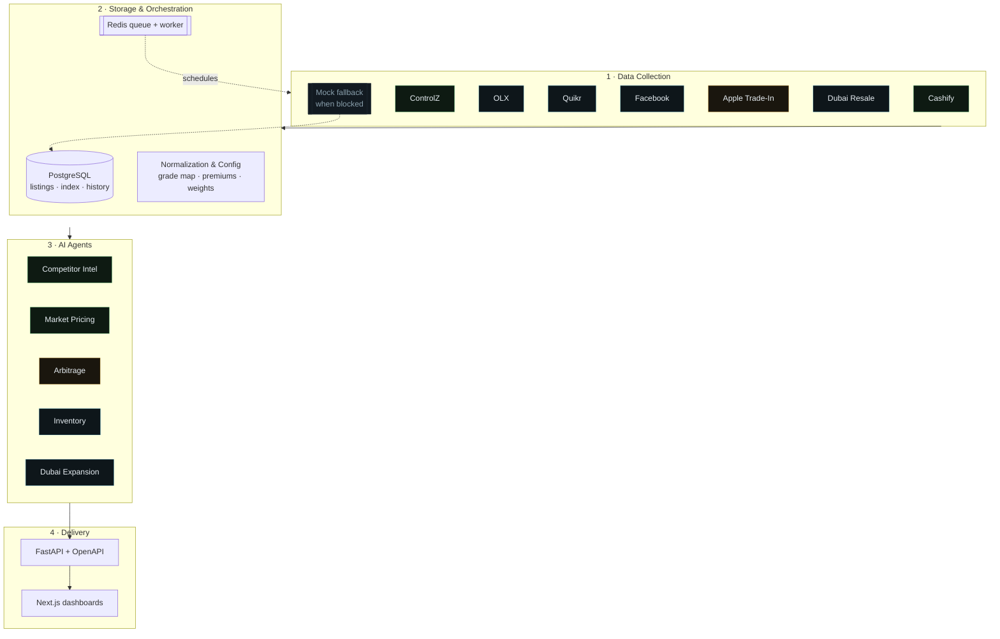

# Architecture

Maple's AI Department is a four-tier pipeline that turns a fragmented, noisy,
multi-platform market into a single source of truth for buy/sell pricing.




## 1 · Data Collection Layer

Each platform has a modular scraper (`app/scrapers/*`) that declares its search
URL, DOM selectors and region. Scrapers are **BrightData-compatible** by design:
once `fetch_raw()` is implemented per adapter (a Playwright skeleton ships in
`cashify.py`), setting `BRIGHTDATA_WSS` makes Playwright connect over CDP through
BrightData's Web Unlocker / residential proxy. In this pilot `fetch_raw()` is
intentionally stubbed, so every scrape exercises the mock fallback below.

Every scraper is wrapped in a **resilience contract** (`BaseScraper.scrape`):

```
fetch_raw()  ──success──▶  normalized live listings
     │
   failure (block / captcha / no network / layout change)
     ▼
deterministic mock fallback  ──▶  synthetic-but-consistent listings
```

This is why the pilot is *always functional*: a blocked scrape silently degrades
to mock data drawn from a hidden ground-truth value model.

Every listing is normalized to one schema:

```json
{ "platform","model","variant","storage","battery_health","condition",
  "city","asking_price","listing_date","url",
  "region","sku","series","raw_condition","asking_price_native","currency","seller_type" }
```

## 2 · Storage & Orchestration

- **PostgreSQL** (SQLite locally) holds `listings`, `market_daily` (the Maple
  Used-iPhone Index) and `device_daily` (per-device fair-value history).
- **Redis + worker** (`app/workers/`) run the scheduled *scrape → recompute*
  cycle. With no Redis, the same jobs run synchronously, so nothing is required
  for a laptop demo.
- **Normalization** (`app/normalization.py`) maps every competitor grade
  vocabulary (Mint, Excellent, A+, Average…) into the 4-grade Maple system. The
  mapping is fully configurable (`config.DEFAULT_GRADE_MAP`).

## 3 · AI Agents (the Department)

Deterministic analytical workers (`app/agents/*`) that read the market and emit
structured insight. They share one fair-value engine so every agent agrees on
"value":

| Agent | Produces |
|---|---|
| **Competitor Intelligence** | lowest/median per platform, premium vs value sellers, price movement, platform × series heatmap |
| **Market Pricing** | condition-normalized fair value + recommended buy/sell for every grade |
| **Arbitrage** | inter-city buy-low/sell-high spreads + opportunity value |
| **Inventory** | demand scores, underpriced acquisition targets, oversupply, gaps, KPIs |
| **Dubai Expansion** | India⇄Dubai spread, landed-cost margin, export-opportunity score |

### The pricing math

1. **Restate** each listing to a reference grade/city/platform depending on the
   question (valuation removes all three; arbitrage keeps the geography).
2. **Weight** by source trust × recency (half-life decay) × condition
   confidence, then trim outliers.
3. **Fair value** = blend of weighted median and weighted mean.
4. **Recommendation formula** (all knobs in `config.PricingConfig`):

```
Recommended Sell = Market Median + Brand + Warranty + Maple-Trust premiums
Recommended Buy  = Sell − Target Margin − Refurb − Logistics − Warranty Reserve
```

## 4 · Delivery

- **FastAPI** exposes the agents, metrics, pricing, listings and scrape
  controls, with auto-generated OpenAPI docs at `/docs`.
- **Next.js** renders four dashboards (Executive, Competitor, Dubai, Inventory)
  with Tailwind + Recharts, fetching the API client-side.

## Why the demo tells a *true* story

The mock generator projects a hidden `true_superb_value(device, day)` through the
**same** condition/city/platform multipliers the pricing engine inverts. So the
Market Pricing Agent recovers the hidden value (±1%), the Arbitrage Agent finds
the city spreads that were baked in, and the Dubai Agent finds the real AED gap —
the insight is genuine, not hand-waved.
